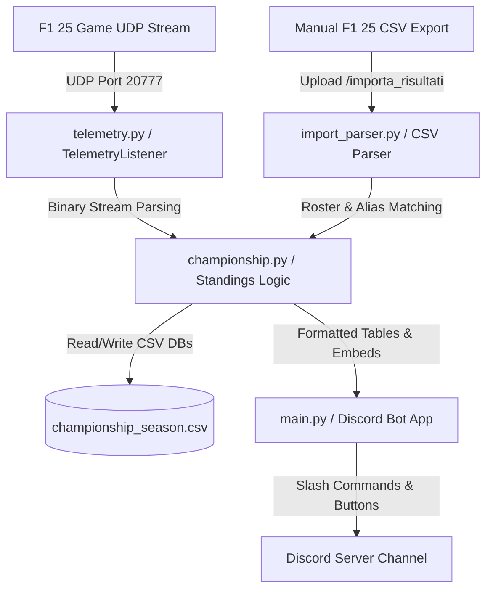

# Angelo Bot - F1 25 Discord Telemetry Tracker 🏎️📊

> **A premium Python-based Discord Bot that listens to UDP telemetry from F1 25, tracks driver/constructor standings, supports interactive Slash Commands, and publishes high-fidelity results.**

---

## 📋 Table of Contents
1. [Overview](#-overview)
2. [Key Features](#-key-features)
3. [Architecture & Decoupling](#-architecture--decoupling)
4. [Slash Commands & Bot UI](#-slash-commands--bot-ui)
5. [Math & Telemetry Specifications](#-math--telemetry-specifications)
6. [Getting Started](#-getting-started)
   - [Prerequisites](#1-prerequisites)
   - [Setup & Environment](#2-setup--environment)
   - [F1 25 Game Settings](#3-f1-25-game-settings)
7. [Future Roadmap](#-future-roadmap)

---

## 🧠 Overview

**Angelo Bot** is a high-performance Discord companion for **F1 25** league races. It acts as an automated clerk of the course and championship archivist. By capturing UDP telemetry packages directly from the game client, the bot processes race finishes, applies official FIA scoring rules, and automatically posts updates, standings, and visual embeds directly to your league's Discord server.

For instances where UDP telemetry is disconnected or fails due to network issues, it incorporates a comprehensive **CSV importer** that can parse official F1 25 session exports, resolve driver omonymies/aliases, and compute manual penalties seamlessly.

---

## ✨ Key Features

*   **UDP Telemetry Parsing**: Captures F1 25 telemetry streams at high frequency (Port `20777`) using native Python sockets and custom binary parsers.
*   **Dynamic Multi-Championship Management**: Allows the league administrator to create, load, list, and delete distinct championship CSV databases (e.g. `/nuovo_campionato`, `/campionati_lista`) for running multiple seasons or tiers.
*   **Automated FIA Scoring**: Integrates official FIA scoring systems (25-18-15-12-10-8-6-4-2-1) for both Drivers and Constructors, with validation for Fast Lap bonus points.
*   **Interactive Discord UI**: Embeds rich buttons (`ConfirmView` confirmation dialogs) to prevent accidental data wipes or race cancellations.
*   **Intelligent Roster Alias Matching**: Translates raw in-game driver names and the default "Utente" placeholder into canonical real names (e.g. "Antonelli" -> "Andrea Kimi Antonelli") based on configurable cross-play roster aliases.
*   **CSV Result Manual Import**: Bypass UDP networking via `/importa_risultati`, allowing direct parsing of game-exported CSV files, including custom time penalty calculations in seconds.

---

## 🏗️ Architecture & Decoupling

The bot separates networking, business logic, and Discord API integration:



### Module Breakdown:
*   **`main.py`**: Initiates the Discord bot client using `discord.py` (`app_commands`), handles bot events, configures guild intents, and orchestrates the UDP telemetry thread.
*   **`telemetry.py`**: Hosts the `TelemetryListener` class which handles the UDP socket, parses binary header data, and triggers session-end callbacks.
*   **`championship.py`**: Performs core mathematical operations, standings updates, constructor point distributions, and persistent CSV storage.
*   **`import_parser.py`**: Slices, canonicalizes, and translates in-game CSV exports, solving cross-play ID discrepancies.
*   **`config.py` / `config.json`**: Holds team-to-driver mappings, driver aliases, and default channel locks.

---

## 💬 Slash Commands & Bot UI

Angelo Bot uses modern Discord **Slash Commands** (`app_commands`) and **UI Buttons**:

*   **Championship Admin**:
    *   `/nuovo_campionato [nome]`: Creates a new independent standings database.
    *   `/campionati_lista`: Lists all archived seasons.
    *   `/importa_risultati [allegato_csv] [penalita_sec]`: Manually imports a race CSV with penalty offsets.
*   **Roster Management**:
    *   `/imposta_scuderia [pilota] [team]`: Binds a driver to an F1 team.
    *   `/assegnazioni_scuderia`: Lists current roster configurations.
    *   `/rinomina_pilota [vecchio_nome] [nuovo_nome]`: Modifies roster keys in case of gamertag changes.
*   **League View**:
    *   `/classifica`: Displays an elegant, formatted embed with both Driver and Constructor standings.
    *   `/pulisci [quantita]`: Clears chat histories to keep the channel clean while locking the latest standings report at the bottom.

---

## 🛠️ Getting Started

### 1. Prerequisites
- Python 3.12+
- Discord Bot Token with **Message Content Intent** enabled in the Developer Portal.

### 2. Setup & Environment
1. Clone the repository and install requirements:
   ```powershell
   python -m venv .venv
   .venv\Scripts\Activate.ps1
   pip install -r requirements.txt
   ```
2. Create your `.env` file based on `.env.example`:
   ```ini
   DISCORD_TOKEN=your_discord_bot_token_here
   DISCORD_CHANNEL_ID=your_target_channel_id_here
   ```
3. Customize your driver roster, team assignments, and alias rules in `config.py`.
4. Launch the bot:
   ```powershell
   powershell .\avvia_bot.bat
   ```

### 3. F1 25 Game Settings
To enable automatic telemetry capturing:
1. Open F1 25 and navigate to **Game Options > Settings > Telemetry Settings**.
2. Set **Telemetry** to **On**.
3. Set **UDP IP Address** to `127.0.0.1` (or your host's local IP).
4. Set **UDP Port** to `20777`.
5. Set **UDP Format** to `2025` (or F1 25).
